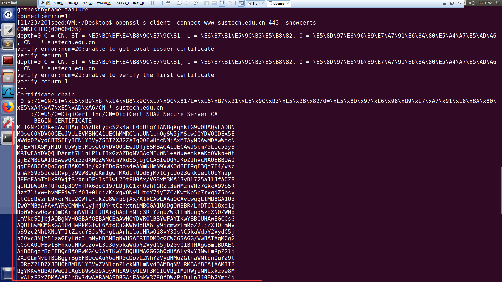
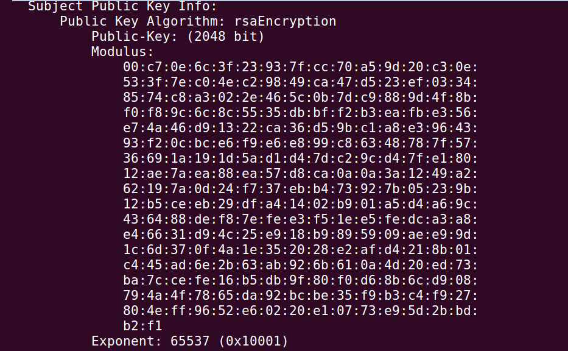
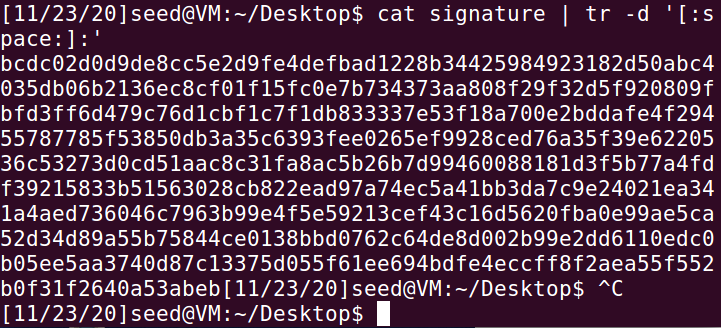
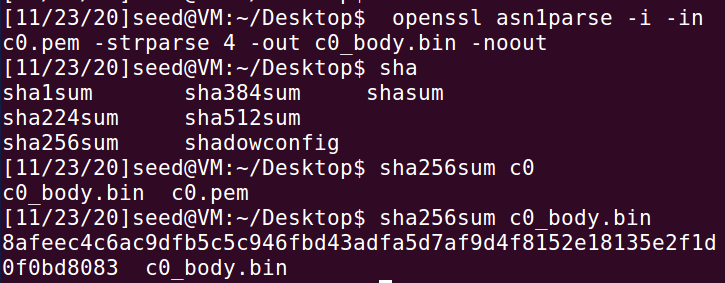
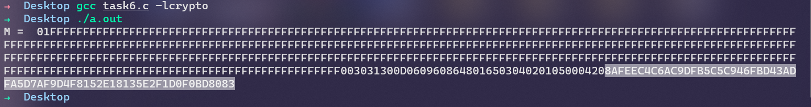

# 11811407Lab10

**Name: **黎诗龙

**SID: **11811407

## Task1


$$
\phi(n) = (p-1)(q-1)
\\ ed\equiv 1\mod {\phi(n)}
\\\to d \equiv e^{-1} \mod {\phi(n)}
$$

```c
BN_CTX *ctx = BN_CTX_new();
BIGNUM *p = BN_new();
BIGNUM *p_ = BN_new();//p-1
BIGNUM *q = BN_new();
BIGNUM *q_ = BN_new();// q-1
BIGNUM *e = BN_new();
BIGNUM *d = BN_new();
BIGNUM *phi = BN_new();

BN_hex2bn(&p,"F7E75FDC469067FFDC4E847C51F452DF");
BN_hex2bn(&q,"E85CED54AF57E53E092113E62F436F4F");
BN_hex2bn(&e,"0D88C3");
BN_hex2bn(&p_,"F7E75FDC469067FFDC4E847C51F452DE");//p-1
BN_hex2bn(&q_,"E85CED54AF57E53E092113E62F436F4E");//q-1

BN_mul(phi,p_,q_,ctx);
BN_mod_inverse(d,e,phi,ctx);
print_BN("d = ", d);
```

From the equations we can write the codes, then we can get that d (private key):


## Task2

From the equation
$$
C \equiv M^e\mod {n}
$$
we can write the codes

```c
BN_CTX *ctx = BN_CTX_new();
BIGNUM *n = BN_new();
BIGNUM *M = BN_new();
BIGNUM *e = BN_new();
BIGNUM *d = BN_new();
BIGNUM *C = BN_new();

BN_hex2bn(&n,"DCBFFE3E51F62E09CE7032E2677A78946A849DC4CDDE3A4D0CB81629242FB1A5");
BN_hex2bn(&e,"010001");
BN_hex2bn(&M,"4120746f702073656372657421");
BN_hex2bn(&d,"74D806F9F3A62BAE331FFE3F0A68AFE35B3D2E4794148AACBC26AA381CD7D30D");

//M^e mod n

BN_mod_exp(C,M,e,n,ctx);
print_BN("C = ", C);
```

Then we can get the result $C$:


## Task3

From the equation:
$$
M\equiv C^d\mod {n}
$$
We can write this codes:

```c
BN_CTX *ctx = BN_CTX_new();
BIGNUM *n = BN_new();
BIGNUM *M = BN_new();
BIGNUM *e = BN_new();
BIGNUM *d = BN_new();
BIGNUM *C = BN_new();

BN_hex2bn(&n,"DCBFFE3E51F62E09CE7032E2677A78946A849DC4CDDE3A4D0CB81629242FB1A5");
BN_hex2bn(&e,"010001");
BN_hex2bn(&d,"74D806F9F3A62BAE331FFE3F0A68AFE35B3D2E4794148AACBC26AA381CD7D30D");
BN_hex2bn(&C,"8C0F971DF2F3672B28811407E2DABBE1DA0FEBBBDFC7DCB67396567EA1E2493F");

BN_mod_exp(M,C,d,n,ctx);
print_BN("M = ", M);
```

And we get this result:


## Task4

First encoding the message, we get


We use **private key** to sign the message

we can write the codes

```c
BN_CTX *ctx = BN_CTX_new();
BIGNUM *n = BN_new();
BIGNUM *e = BN_new();
BIGNUM *d = BN_new();
BIGNUM *M1 = BN_new();
BIGNUM *M2 = BN_new();
BIGNUM *C1 = BN_new();
BIGNUM *C2 = BN_new();

BN_hex2bn(&n,"DCBFFE3E51F62E09CE7032E2677A78946A849DC4CDDE3A4D0CB81629242FB1A5");
BN_hex2bn(&e,"010001");
BN_hex2bn(&d,"74D806F9F3A62BAE331FFE3F0A68AFE35B3D2E4794148AACBC26AA381CD7D30D");
BN_hex2bn(&M1,"49206f776520796f752024323030302e");
BN_hex2bn(&M2,"49206f776520796f752024333030302e");

BN_mod_exp(C1,M1,d,n,ctx);
print_BN("C1 = ", C1);
BN_mod_exp(C2,M2,d,n,ctx);
print_BN("C2 = ", C2);
```

And get the result:


## Task5

First encoding the message:


We use public key ***e*** to verify the signature, so we write the codes:

```c
BN_CTX *ctx = BN_CTX_new();
BIGNUM *n = BN_new();
BIGNUM *e = BN_new();
BIGNUM *d = BN_new();
BIGNUM *S = BN_new();
BIGNUM *M = BN_new();
BIGNUM *C = BN_new();

BN_hex2bn(&n,"AE1CD4DC432798D933779FBD46C6E1247F0CF1233595113AA51B450F18116115");
BN_hex2bn(&e,"010001");
BN_hex2bn(&S,"643D6F34902D9C7EC90CB0B2BCA36C47FA37165C0005CAB026C0542CBDB6802F");
BN_hex2bn(&M,"4120746f702073656372657421");
BN_hex2bn(&d,"74D806F9F3A62BAE331FFE3F0A68AFE35B3D2E4794148AACBC26AA381CD7D30D");

BN_mod_exp(C,S,e,n,ctx);
print_BN("C = ", C);
```

And we get such result:


This verifies that it is from Alice.

And if the ``2F`` becomes ``3F``, then it becomes


It corrupts.

## Task6

### Step1

In this task I use command ``openssl s_client -connect www.baidu.com:443 -showcerts`` to get the certs from www.baidu.com



### Step2

``openssl x509 -in c1.pem -text -noout`` we got this



### Step3 

``openssl x509 -in c0.pem -text -noout``

``cat signature | tr -d '[:space:]:'``

I got the signature like this



### Step4

``openssl asn1parse -i -in c0.pem -strparse 4 -out c0_body.bin -noout``

``sha256sum c0_body.bin``

I got this hash:



Then we write codes like this, the basic idea is to use the public key of in the ``c1.pem``.

```c
BN_CTX *ctx = BN_CTX_new();
BIGNUM *M = BN_new();
BIGNUM *e = BN_new();
BIGNUM *n = BN_new();
BIGNUM *S = BN_new();

BN_hex2bn(&n, "00c70e6c3f23937fcc70a59d20c30e533f7ec04ec29849ca47d523ef03348574c8a3022e465c0b7dc9889d4f8bf0f89c6c8c5535dbbff2b3eafbe356e74a46d91322ca36d59bc1a8e3964393f20cbce6f9e6e899c86348787f5736691a191d5ad1d47dc29cd47fe18012ae7aea88ea57d8ca0a0a3a1249a262197a0d24f737ebb473927b05239b12b5ceeb29dfa41402b901a5d4a69c436488def87efee3f51ee5fedca3a8e46631d94c25e918b9895909aee99d1c6d370f4a1e352028e2afd4218b01c445ad6e2b63ab926b610a4d20ed73ba7ccefe16b5db9f80f0d68b6cd908794a4f7865da92bcbe35f9b3c4f927804eff9652e60220e10773e95d2bbdb2f1");
BN_hex2bn(&e, "010001");
BN_hex2bn(&S, "bcdc02d0d9de8cc5e2d9fe4defbad1228b34425984923182d50abc4035db06b2136ec8cf01f15fc0e7b734373aa808f29f32d5f920809fbfd3ff6d479c76d1cbf1c7f1db833337e53f18a700e2bddafe4f29455787785f53850db3a35c6393fee0265ef9928ced76a35f39e6220536c53273d0cd51aac8c31fa8ac5b26b7d99460088181d3f5b77a4fdf39215833b51563028cb822ead97a74ec5a41bb3da7c9e24021ea341a4aed736046c7963b99e4f5e59213cef43c16d5620fba0e99ae5ca52d34d89a55b75844ce0138bbd0762c64de8d002b99e2dd6110edc0b05ee5aa3740d87c13375d055f61ee694bdfe4eccff8f2aea55f552b0f31f2640a53abeb");
BN_mod_exp(M, S, e, n, ctx);
print_BN("M = ", M);
```

Then we got this:



The last 64 bytes is just the same as the hash value, which verifies that it is valid.


## Summary

RSA public-key encryption and signature is widely used in our life, and this asymmetric encryption secures the information.

It usually uses 256 bits big number to generate public key and private key. From our program we can see that it is hardly to calculate and get the results by human, and it is hard to get the prime factors of the big number.

In the previous course Discrete Math we know the basic concept and operations of the RSA, and in this lab, I put the RSA into real life, and do the practice using baidu.com certs. It is helpful for me to understand more.

