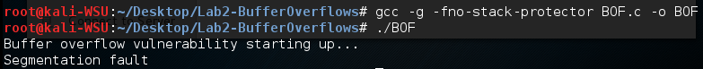
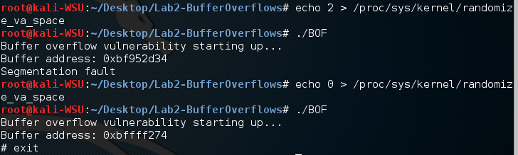
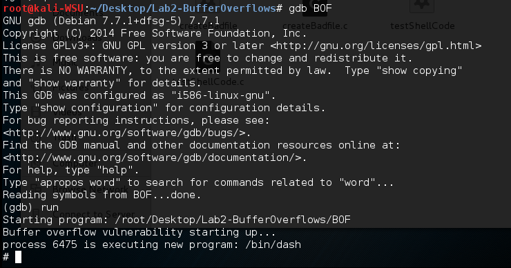
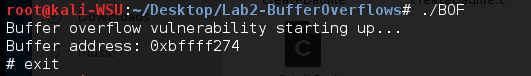
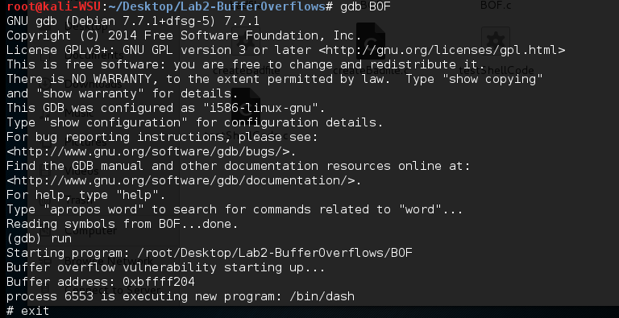
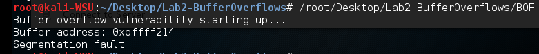

# Lab2

**Name: 黎诗龙**

**SID: **11811407

4. 

   (a) It will occur segmentation fault.

   

   (b) It will occur segmentation fault in the command line, **but** it still can be run in the GDB. The return address changes.
   
   I add a sentence `print("Buffer address: %p", buffer)` in the function  `bufferOverflow`, which comes from my classmates Zunyao, Mao, to print the buffer address.
   
   
   
   From the buffer address we can infer that the return address has been **changed**.
   
   
   
   
   
   
   
   (c) They are not the same. 
   
   | method                                 | buffer[] address |
   | -------------------------------------- | ---------------- |
   | gdb BOF                                | 0xbffff204       |
   | /root/Desktop/Lab2-BufferOverflows/BOF | 0xbffff214       |
   | ./BOF                                  | 0xbffff274       |
   
   

