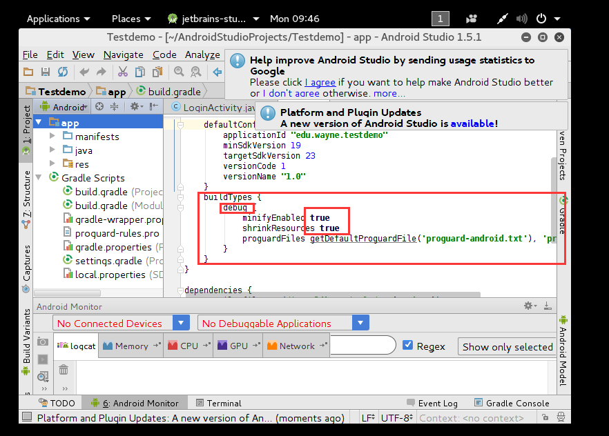

# Lab5

**Name**: 黎诗龙

**SID:**11811407

## 2

file name: 

`LoginActivity.smali`

smali method:

I add `invoke-static {v1, v3},Landroid/util/Log;->d(Ljava/lang/String;Ljava/lang/String;)I` into it.

`invoke-static` is the method of `Log.d(xxx,xxx)` in smali.

## 3

From the picture we can see the username is `foo@example.com` and password is `hello`. 

## 4

### a

ProGuard

### b

I modify the configuration in the `build.gradle(Module....)`  

Add this into it:

Then rebuild the apk:

From the picture we can see that `app-debug.apk` is 790.8KB, while previously it is around 1.43MB.

And open the LoginActivity.smali, we cannot see the `.line x`.

And in the directory we can see it has been obfuscated:

Then I continue the repackaging process:

**It can be repackaged. The proof is above.**