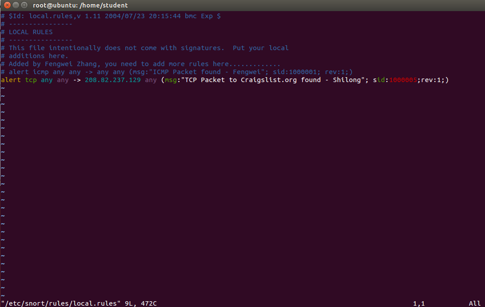
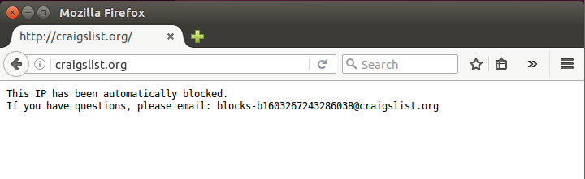
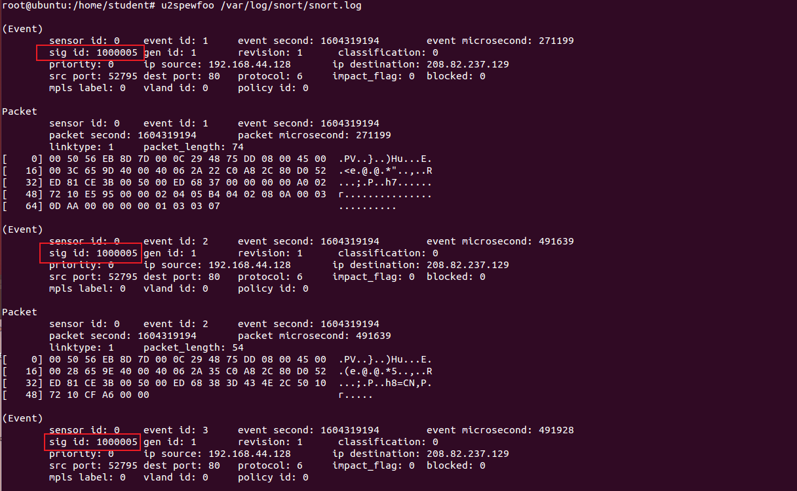

# Lab7

**Name:** 黎诗龙

**SID: **11811407

## 2

### a

A zero-day attack is an attack for a vulnerability that is unknown to the public community.

[**Refer** to P. Garcia-Teodoro, J. Diaz-Verdejo, G. MaciaFernandez, and E. Vazquez, “Anomaly-based network intrusion detection: Techniques, systems and challenges,” Computers and Security, vol. 28, no. 1–2, pp. 18–28, 2009. ]

Zero-day vulnerabilities can take almost any form, including SQL injection, buffer overflows, missing authorizations, etc. 

[**Refer** to https://www.checkpoint.com/cyber-hub/threat-prevention/what-is-zero-day-attack/]

### b

Snort **may** catch zero-day network attacks.

The reason:

*Rules are a different methodology for performing detection, which bring the advantage of 0-day detection to the table. Unlike signatures, rules are based on detecting the actual vulnerability, not an exploit or a unique piece of data. Developing a rule requires an acute understanding of how the vulnerability actually works.*

[Refer to https://www.snort.org/faq/what-is-a-snort-rule]

*Signature of detection is typically classified as day after detection, as actual public exploits are necessary for this type of detection to work. Anti-Virus companies utilize this type of technology for protecting their customers from virus outbreaks. As we have seen over the years this type of protection only has limited protection capabilities as the virus has already infected someone before a signatures can be written.*

[Refer to https://www.snort.org/faq/what-is-a-signature]

From above we can see that we can use Snort rules to detect 0-day attack.

### c

Given that:
$$
\frac{TP+FN}{TP+FN+FP+TN}=0.1\%=0.001 (1)
\\\textbf{true positive rate} = \frac{TP}{TP+FN}=0.95 (2)\\ 
\textbf{alarm is an attack} = \frac{TP}{TP+FP}=0.95 (3)
$$
Solution:

All we need is to get $\frac{FP}{FP+TP}$.
$$

\\ \frac{FP}{FP+TP} = 1-\frac{TP}{FP+TP} = 0.05
$$
The false alarm rate is `5%`. 

## 3

### a

I add this rule,`alert tcp any any -> 208.82.237.129 any (msg:"TCP Packet to Craigslist.org found - Shilong"; sid:1000005;rev:1;)`, into the `local.rules`. 

### b

I open the firefox explorer to visit `craigslist.org`.

### c

